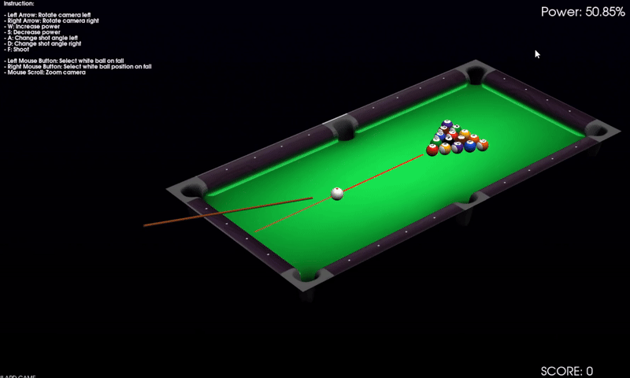

# Billard Game

**Billard Game** is an interactive billiard game created in C++ using libraries like **VTK** and **Qt**. The game offers dynamic gameplay with physics handling, including wall collisions, shot power, and angle adjustments. The project uses graphical user interfaces to control the game and visual effects to enhance the user experience.

## Showcase

To see how the game looks in action, here’s a GIF showing part of the gameplay:



## Features

- **Wall Collisions**: The game tracks collisions and reflects the balls off the walls accordingly.
- **Camera Rotation**: Use the arrow keys to rotate the camera.
- **Shot Power Adjustment**: Increase or decrease shot power using the "W" and "S" keys.
- **Shot Angle Adjustment**: Adjust the shot angle with the "A" and "D" keys.
- **Interactive Gameplay**: Use the left mouse button to select the white ball after it has been pocketed, and the right mouse button to set its position when it is placed back on the table.
- **Camera Zoom**: Use the mouse scroll wheel to zoom in or out.
- **Start the Game**: The game starts when you press the "F" key to shoot.

## Requirements

- **C++**: A C++14 or higher compatible compiler.
- **VTK**: A library for 3D rendering.
- **Qt**: A framework for creating graphical user interfaces.
- **CMake**: A build configuration tool.

## Installation

1. **Clone the repository**:

```bash
git clone https://github.com/d4krzyk/Billiard-Model.git
cd Billard-Model
```

2. **Install dependencies**:

   Install **cmake**, **VTK** (last version) and **Qt** (version 5 and higher).

3. **Build the project**:

   Use **CMake** to configure the project.

   ```bash
   mkdir build
   cd build
   cmake ..
   make
   ```

4. **Run the game**:

   After the build completes, run the game in this folder:

   ```bash
   ./build/Release/MinimalQtVTKApp.exe
   ```

## Controls

- **Left/Right Arrow**: Rotate the camera.
- **W/S**: Increase or decrease shot power.
- **A/D**: Change the shot angle.
- **Left Mouse Button**: Select the white ball after it has been pocketed.
- **Right Mouse Button**: Set the position of the white ball when it is placed back on the table.
- **Mouse Scroll**: Zoom in or out with the camera.
- **F**: Shoot a white ball.


## Contributing

Want to help improve the project? Feel free to submit a pull request or open an issue to suggest new ideas or report bugs!
